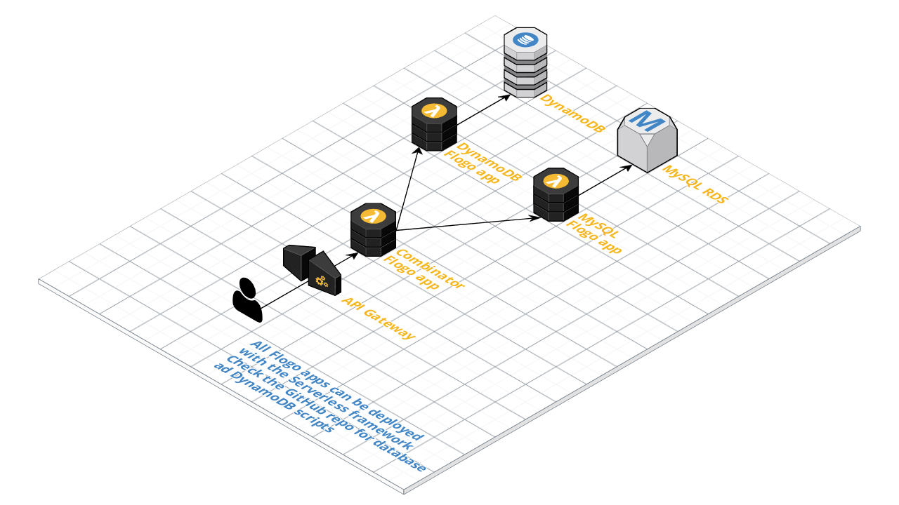

# Serverless demo



## Prerequisites
The following prerequisites have to be met

* Go 1.10 or higher has to be installed
* Node.js 9.x or higher has to be installed
* The latest version of the Flogo CLI has to be installed (`go get -u github.com/TIBCOSoftware/flogo-cli/...`)

## MySQL
Within the Amazon RDS console create a new MySQL database with the default settings for **Dev/Test - MySQL**. Once completed, create a new table using the this SQL statement
```sql
create table customer (
	id INT,
	FirstName VARCHAR(50),
	LastName VARCHAR(50),
	email VARCHAR(50),
	Phone VARCHAR(50),
	DOB DATE,
	Address VARCHAR(50),
	City VARCHAR(50),
	State VARCHAR(50),
	ZIP VARCHAR(50)
);
insert into customer (id, FirstName, LastName, email, Phone, DOB, Address, City, State, ZIP) values (1, 'Pauly', 'Boken', 'pboken0@latimes.com', '256-656-7372', '4/3/1930', '50 Kings Parkway', 'Anniston', 'Alabama', '36205');
insert into customer (id, FirstName, LastName, email, Phone, DOB, Address, City, State, ZIP) values (2, 'Boy', 'Kondratenya', 'bkondratenya1@acquirethisname.com', '205-389-4566', '11/18/1968', '95 Commercial Avenue', 'Tuscaloosa', 'Alabama', '35405');
insert into customer (id, FirstName, LastName, email, Phone, DOB, Address, City, State, ZIP) values (3, 'Karlik', 'Drinkeld', 'kdrinkeld2@theguardian.com', '253-206-3687', '9/27/1959', '4 Forest Dale Terrace', 'Tacoma', 'Washington', '98424');
```

_The data has been generated with [Mockaroo](https://www.mockaroo.com/)_

After creating the database, the default setting is that you can only access the database from your IP address. To make sure you can access it from other places (including the Lambda functions) you'll need to update the **Security Group** to allow access to port **3306** from all IP addresses

## DynamoDB
Within the Amazon DynamoDB console create a new table with a **Partition key** called **itemtype** and a **Sort key** called **itemid**

To insert some data into the DynamoDB you can use these JSON objects:
```json
{
    "city": "Xiadu",
    "country": "China",
    "itemid": "4ee5f4b6-e75b-45a0-a544-21c2d584c4f8",
    "itemtype": "address",
    "number": "3",
    "street": "9 Gerald Park",
    "userid": "115b84b3-9996-422a-876e-0964ac953277"
}
```
```json
{
    "city": "Zouila",
    "country": "Tunisia",
    "itemid": "4e3debe0-043f-4470-8e0e-200d537e0c80",
    "itemtype": "address",
    "number": "4",
    "street": "9379 Crowley Terrace",
    "userid": "cbbc5aad-82ea-49a0-91db-f775601d3183"
}
```
```json
{
    "city": "Xibër-Murrizë",
    "country": "Albania",
    "itemid": "eabcee73-c321-422f-8481-a04d1cb73c01",
    "itemtype": "address",
    "number": "5",
    "street": "45 Dwight Park",
    "userid": "9cce8d91-8032-4c58-9376-22dab7c99b8d"
}
```
```json
{
    "city": "Kuching",
    "country": "Malaysia",
    "itemid": "c484d35c-9002-48af-8b88-41524679ce0a",
    "itemtype": "address",
    "number": "2542",
    "postcode": "93520",
    "street": "7407 Dottie Pass",
    "userid": "c9f120a2-bb86-4c52-b199-d67ac5d57050"
}
```
```json
{
    "city": "Almenara",
    "country": "Brazil",
    "itemid": "66d59bc6-a355-4976-a36f-b3fa8902513e",
    "itemtype": "address",
    "number": "03055",
    "postcode": "39900-000",
    "street": "40133 Pierstorff Avenue",
    "userid": "f25bbac9-c759-4fe2-a0ec-9a3a3051bc0d"
}
```

_Note that they all have to be copied separately, as DynamoDB doesn't support creating multiple entries at the same time_

_The data has been generated with [Mockaroo](https://www.mockaroo.com/)_

## Creating the apps
Execute the following commands to create the Flogo apps on disk

### MySQL app
```
# Create and build the MySQL app
$ flogo create -f mysql.json mysqlapp
$ cd mysqlapp
$ flogo build -e -shim mysql_lambda_trigger
```

### DynamoDB app
```
# Create and build the DynamoDB app
$ flogo create -f dynamodb.json dynamodbapp
$ cd dynamodbapp
$ flogo build -e -shim dynamodb_lambda_trigger
```

### Combinator app
```
# Create and build the Combinator app 
$ flogo create -f combinator.json combinatorapp
$ cd combinatorapp
$ flogo build -e -shim start_flow_as_a_function_in_lambda
```

## Package and deploy using the Serverless Framework
We'll use the [Serverless Framework](https://serverless/com) to deploy the apps. The Serverless Framework makes it incredibly easy to deploy and lifecycle apps.

_Note that before this step you'll want to update the *.serverless.yml files to make sure the environment variables are set correctly_

### MySQL app
```
# Create the serverless directory
$ cd mysqlapp
$ mkdir serverless
# Copy the serverless.yml file
$ cp ../mysql.serverless.yml ./serverless/serverless.yml
# Copy the executable to the right folder
$ mkdir -p ./serverless/bin
$ cp src/mysqlapp/handler ./serverless/bin/handler
# Create the serverless package
$ cd serverless
$ serverless deploy
```

### DynamoDB app
```
# Create the serverless directory
$ cd dynamodbapp
$ mkdir serverless
# Copy the serverless.yml file
$ cp ../dynamodb.serverless.yml ./serverless/serverless.yml
# Copy the executable to the right folder
$ mkdir -p ./serverless/bin
$ cp src/dynamodbapp/handler ./serverless/bin/handler
# Create the serverless package
$ cd serverless
$ serverless deploy
```

### Combinator app
_Note that this app relies on the ARNs of the previous two apps. You'll have to copy those into the serverless.yml file before executing `serverless deploy`_
```
# Create the serverless directory
$ cd combinatorapp
$ mkdir serverless
# Copy the serverless.yml file
$ cp ../combinator.serverless.yml ./serverless/serverless.yml
# Copy the executable to the right folder
$ mkdir -p ./serverless/bin
$ cp src/combinatorapp/handler ./serverless/bin/handler
# Create the serverless package
$ cd serverless
$ serverless deploy
```

## Testing
Each of the functions can be tested from either the Lambda console or by executing `serverless invoke -f <name>` where `<name>` is the name of the function (like **mysql** or **dynamodb**). The final `serverless deploy` command, for the combinator app, will also output an endpoint URL which can be used to invoke the API (like `curl https://***.execute-api.us-west-2.amazonaws.com/dev/combinator`). Please note that the API endpoint is accessible to the entire Internet :)