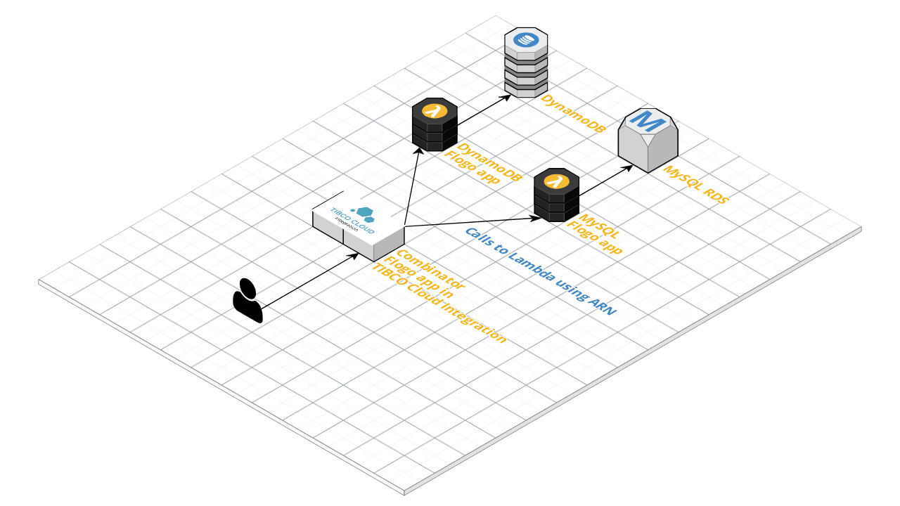

# Flogo apps in TIBCO Cloud Integration

## Prerequisites
The following prerequisites have to be met

* You need to have the [DynamoDB](../serverless-demo/dynamodb.json) and [MySQL](../serverless-demo/mysql.json) Flogo apps running on Lambda
* You'll need to import the Lambda activity to TIBCO Cloud Integration (to do that, simply copy the Lambda activity from the [Flogo Contrib](https://github.com/TIBCOSoftware/flogo-contrib/tree/master/activity/lambda) repository and update the `ref` attribute to `"ref": "lambda/activity/lambda"`)

## API Specification
The file `combinator.json` is the API specification (swagger spec) that the combinator app for TIBCO Cloud Integration is built on. The combinator app acts the same way as the one in the `serverless-demo` folder by orchestrating two calls to Lambda functions.

## TCI app
You can import the app by following the steps in the [docs](https://integration.cloud.tibco.com/docs/flogo/GUID-FCA1D199-1A53-4F78-8E65-7C014098F98E.html)

## Testing
After deploying this app you can test it using the **API tester** in TIBCO Cloud Integration.